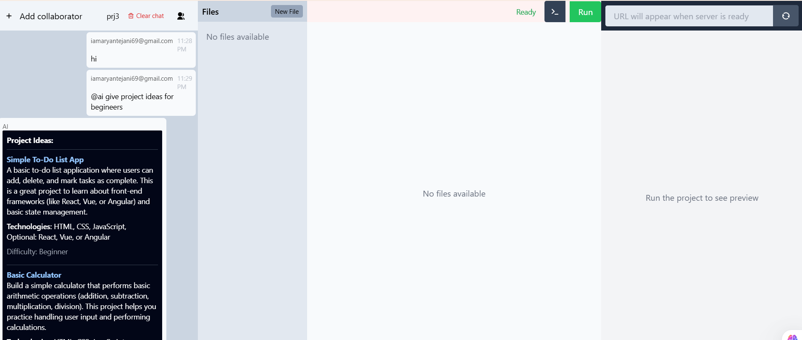
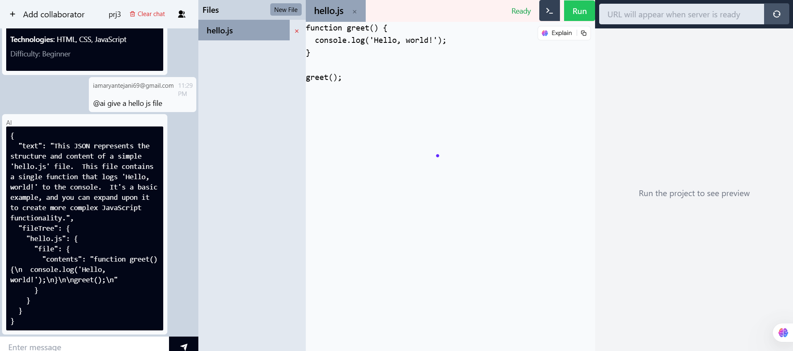
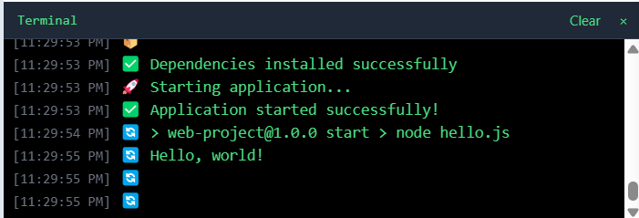
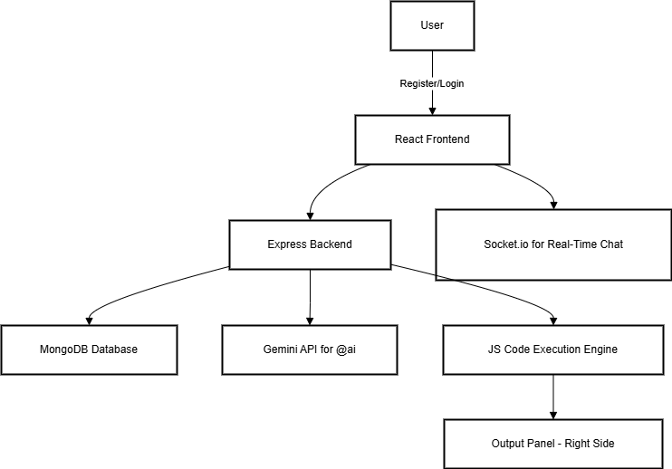

# 🚀 TechnoSenpai - AI-Powered Collaborative Coding Chat App

**TechnoSenpai** is a real-time, anime-themed collaborative chat app for developers where teams can discuss, generate code, and even run JavaScript — all with the help of an **AI assistant powered by Gemini API**.

> 🛠️ Built with 💻 during **Dev Heat Hackathon 2025**  
> 🧙 Team: **Solo Levelling**

---

## 🌟 Features

- 👤 **Register/Login**
- 👥 **Create Private Coding Groups**
- 📧 **Invite Collaborators via Email**
- 💬 **Real-time Chat Interface (WhatsApp style)**
- 🤖 **Summon AI using `@ai`**  
  - Ask programming questions  
  - Get code for **JS / C++ / Python**
- 📄 **Right-side code panel**
- ▶️ **JavaScript File Execution** *(Currently not working in deployed version)*

---

## 🖼️ Screenshots

### 👥 Group Chat + AI Panel  

### 🤖 Gemini-Powered Code Suggestion  

### Terminal 

> 💡 Screenshots reflect actual working features

---

## 🛠️ Tech Stack

| Layer         | Technology         |
|---------------|--------------------|
| Frontend      | React.js, Tailwind CSS |
| Backend       | Node.js, Express.js |
| Realtime Chat | Socket.io           |
| Database      | MongoDB             |
| AI Assistant  | **Gemini API** by Google |
| JS Runner     | In-browser Execution (Client-side) |

---

## 🧠 System Architecture

